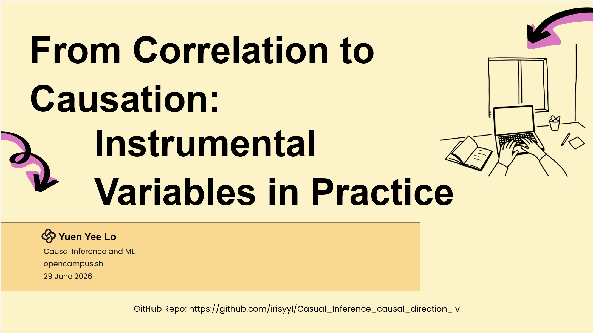

# From Correlation to Causation: Instrumental Variables in Practice

## Repository Link

https://github.com/irisyyl/Casual_Inference_causal_direction_iv

## Description

This project explores causal identification using instrumental variables (IV)
across five synthetic datasets from the CausalPitfalls NeurIPS 2025 benchmark.
It investigates when OLS is reliable, when IV correction is necessary, and how
robust the estimated causal effects are to hidden confounding — across clinical
trial, e-commerce, environmental, marketing, and benchmark settings.

### Task Type

Causal direction identification and causal effect estimation using instrumental
variables (IV) under unmeasured confounding.

### Results Summary

#### Best Model Performance
- **Best Model:** Two-Stage Least Squares (2SLS) with corrected standard errors
- **Evaluation Metric:** First-stage F-statistic (instrument strength),
  exclusion R² ratio (exclusion restriction), Hausman test p-value
  (endogeneity), Imbens (2003) partial-R² robustness value (sensitivity),
  Oster (2019) δ (OLS-chain robustness)
- **Final Performance:**

    | Dataset | Estimator | Causal Effect (β) | First-stage F | IV Valid? |
    |---|---|---|---|---|
    | causal_direction_iv | 2SLS | 0.9318 (t=14.19) | 168.7 | Yes |
    | clinical_trial | OLS fallback | ~1.0 (confounded) | 0.86 | No |
    | ecommerce (income→purchases) | OLS | 0.0100 (t=645.6) | N/A | N/A |
    | ecommerce (visits→purchases) | 2SLS | Not significant (t=1.72) | 124,406 | Yes (null) |
    | environment (soil→crop_yield) | 2SLS | 0.9475 (t=16.67) | 859,535 | Yes |
    | environment (fertilizer→crop_yield) | OLS | 1.2420 (t=73.69) | N/A | N/A |
    | marketing (promo→sales) | OLS | 1.2853 (t=39.02) | N/A | N/A |
    | marketing (ad/brand→sales) | Degenerate IV | ~0.53 (treat w/ caution) | 591,076* | No* |

*High F due to r=0.999 between instrument and treatment — degenerate IV, not genuine strength.

#### Model Comparison
- **Baseline Performance:** 
    - **Baseline Model (OLS):** Estimates the association between treatment and
  outcome under the naive assumption of no endogeneity. Reliable only when
  the treatment is exogenous.
    - **Causal Model (2SLS):** Corrects for endogeneity by isolating the
  exogenous variation in the treatment driven by the instrument. Produces
  unbiased causal estimates when IV assumptions hold.

    | Dataset | OLS β | 2SLS β | Bias (OLS−2SLS) | OLS Reliable? |
    |---|---|---|---|---|
    | causal_direction_iv | Higher than 0.93 | 0.9318 | Upward bias | No |
    | environment (soil) | Higher than 0.95 | 0.9475 | Upward bias | No |
    | ecommerce (income) | 0.0100 | N/A | Minimal | Yes |
    | environment (fertilizer) | 1.2420 | N/A | Minimal | Yes |
    | marketing (promo) | 1.2853 | N/A | Minimal | Yes |
    | clinical_trial | ~1.0 | Unreliable | N/A | Unknown |

- **Improvement Over Baseline:** In datasets with valid IVs, 2SLS removes
  upward endogeneity bias from OLS. The Hausman test confirmed endogeneity
  in causal_direction_iv and environment (soil chain), validating that IV
  correction was necessary. For OLS-only chains, Oster δ > 1 confirms OLS
  estimates are robust to unobserved confounding.
- **Best Alternative Model:** Control Function Approach (CFA) — algebraically
  equivalent to 2SLS in linear models but provides the Hausman endogeneity
  test as a by-product. Anderson-Rubin CI applied to clinical_trial as the
  weak-instrument-robust inference method.

#### Key Insights
- **Most Important Features:** The validity of the instrument is the single
  most important factor. A strong instrument (F > 10) that satisfies the
  exclusion restriction is necessary and sufficient for valid IV estimation.
  Without it, 2SLS produces estimates worse than OLS (clinical_trial, F=0.86).
- **Model Strengths:**   
  - 2SLS successfully identifies causal direction in causal_direction_iv
    (β=0.93, confirmed X_1→X_2 over reverse) and recovers unbiased causal
    effects in the environment soil chain (β=0.95)
  - The IV framework correctly identifies null causal effects (ecommerce:
    visits do not cause purchases despite high correlation with age)
  - Sensitivity analysis (Imbens RV=0.733 for causal_direction_iv) confirms
    the main findings are robust to plausible unmeasured confounding
  - The pipeline correctly detects and flags IV failure modes: weak instruments
    (clinical_trial), degenerate instruments (marketing ad/brand), and
    direct OLS chains (ecommerce income, environment fertilizer)

- **Model Limitations:** 
  - Clinical trial: no valid instrument exists in the available variables.
    Causal identification requires an external instrument such as randomised
    dosage assignment. OLS estimates are reported but may be confounded.
  - Marketing: ad_spend_k and brand_awareness are r=0.999 — statistically
    the same construct. The degenerate IV produces a high F-statistic that
    reflects collinearity, not instrument strength. A genuinely exogenous
    instrument (e.g. media cost shocks) would be needed.
  - Environment soil chain: Imbens RV=0.134 indicates moderate sensitivity
    to unmeasured confounding. Farm management practices that jointly affect
    soil quality and crop yield could plausibly overturn the estimate.
  - All datasets are synthetic (NeurIPS 2025 benchmark) — findings validate
    the methodology rather than producing real-world causal conclusions.

- **Business Impact (Practical implications):** 
  - In clinical settings, randomised controlled trials remain the gold standard
    for causal identification when observational instruments are unavailable.
  - In e-commerce, the null result (visits do not cause purchases) suggests
    that driving site traffic without targeting high-income segments is unlikely
    to increase revenue — income is the direct driver (β=0.01 per dollar).
  - In agriculture, both fertilizer application (β=1.24) and soil quality
    (β=0.95) independently drive crop yield in an additive relationship.
    Fertilizer has a 31% larger effect per unit, but both pathways matter.
  - In marketing, promotional spend (β=1.29) has a 2.4× larger effect on
    sales per unit than ad spend/brand awareness (β≈0.53). Budget allocation
    should favour promotions over brand advertising for direct sales impact.

## Documentation

1. **[Literature Review](0_LiteratureReview/README.md)**
2. **[Dataset Characteristics](1_DatasetCharacteristics/exploratory_data_analysis.ipynb)**
3. **[Baseline Model](2_BaselineModel/baseline_model.ipynb)**
4. **[Model Definition and Evaluation](3_Model/model_definition_evaluation)**
5. **[Presentation](4_Presentation/README.md)**

## Cover Image

